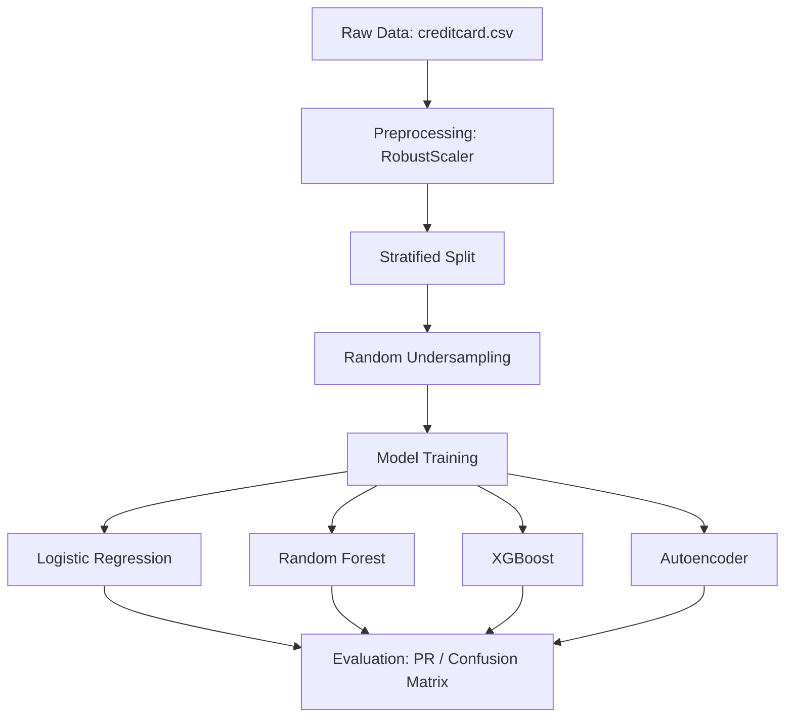

# 💳 Credit Card Fraud Detection

A machine learning project to detect fraudulent credit card transactions. This repository implements classification models (Logistic Regression, Random Forest, and XGBoost) along with an Autoencoder anomaly detector, using imbalance-handling techniques.

---

<p align="center">
  
  
  
  
</p>

---

## 📌 Overview

Credit card fraud detection is challenging due to highly imbalanced datasets. In this dataset, fraud cases make up only **0.17%** of all transactions. 

This project explores:
* Preprocessing with **RobustScaler** to handle outliers in transaction amount and time.
* Handling class imbalance using **Random Undersampling**.
* Training and comparing supervised models (Logistic Regression, Random Forest, XGBoost) and an unsupervised model (Autoencoder).
* Evaluating performance using Precision, Recall, F1-Score, and AUC-ROC.

---

## 🔄 Workflow Pipeline



---

## 📊 Dataset Details

* **Source**: European cardholders dataset (September 2013)
* **Total Transactions**: 284,807
* **Fraud Cases**: 492 (0.172%)
* **Features**: 30 numerical features (V1–V28 are PCA-transformed, while Time and Amount are raw values).
* **Class**: 0 (Legitimate), 1 (Fraud)

---

## 🧹 Preprocessing & Imbalance Handling

1. **Feature Scaling**: Time and Amount are scaled using `RobustScaler` since they contain outliers.
2. **Undersampling**: To prevent majority-class bias, we construct a balanced sub-sample of 984 transactions (492 fraud, 492 legitimate).
3. **Stratification**: Preserves the class ratio during training and testing.

---

## 🤖 Models Used

* **Logistic Regression**: Linear baseline model.
* **Random Forest**: Ensemble decision trees to handle non-linearity.
* **XGBoost**: Gradient boosted decision trees for robust classification.
* **Autoencoder**: Neural network trained only on legitimate transactions; anomaly scores are computed using reconstruction error.

---

## 🏆 Results

### Model Performance (Balanced Sub-sample)

| Model | Precision | Recall | F1 Score | AUC-ROC |
| :--- | :---: | :---: | :---: | :---: |
| **Logistic Regression** | 0.96 | 0.92 | 0.94 | 0.9806 |
| **XGBoost** | 0.96 | 0.92 | 0.94 | 0.9851 |
| **Random Forest** ⭐ | 0.97 | 0.90 | 0.93 | 0.9863 |

---

## 🧠 Key Takeaways

* **Recall is Priority**: Catching fraud (minimizing False Negatives) is more critical than minor drops in precision.
* **Accuracy is Deceptive**: Standard classification accuracy is misleading on highly imbalanced data (99.83% baseline accuracy can catch zero fraud cases).
* **Robust Scaling**: Helps model training by reducing the skewness caused by extreme transaction amounts.

---

## 📂 Project Structure

```
├── data/                  # Local dataset storage (git-ignored)
├── notebooks/             # Jupyter notebooks for exploration
├── results/               # Saved figures and confusion matrices
├── src/                   # Source modules
│   ├── preprocess.py      # Scaling and splitting helper functions
│   ├── imbalance_handler.py# Undersampling function
│   ├── models.py          # Supervised and Autoencoder model architectures
│   └── evaluate.py        # Evaluation and plotting code
├── Screenshot/            # Visual outputs and model run screenshots
├── main.py                # Pipeline execution entry point
├── requirements.txt       # Project dependencies
└── README.md              # Project documentation
```

---

## ⚙️ Quick Start

### 1. Clone the repository
```bash
git clone https://github.com/Shabbir5152/finance-fraud-detection.git
cd finance-fraud-detection
```

### 2. Setup Environment
```bash
python -m venv venv
# Windows
venv\Scripts\activate
# Unix/macOS
source venv/bin/activate
```

### 3. Install Dependencies
```bash
pip install -r requirements.txt
```

### 4. Run the pipeline
Place the Kaggle `creditcard.csv` in a folder named `data/` and run:
```bash
python main.py
```

---

## 📎 References

1. Dal Pozzolo, Andrea, et al. *"Calibrating Probability with Undersampling for Unbalanced Classification."* IEEE Computational Intelligence Magazine, 2017.
2. *"Sequence Classification for Credit-Card Fraud Detection."* Journal of Machine Learning Research, 2018.
